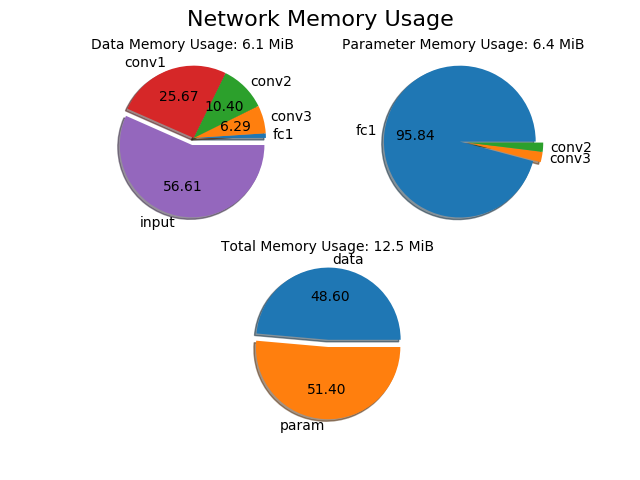
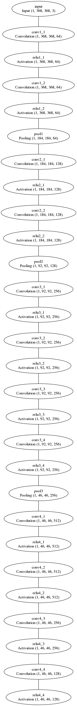

# Ramwatcher
A very lightweight deep learning tool for monitoring **data flow**, **parameter size** and their corresponding **memory usage** throughout deep neural network. This tool **doesn't** need any powerful computational resource (eg. GPU). And it's very easy to use since it follows many similar rules in popular deep learning frameworks (**Caffe**, **Tensorflow**, **Torch**)

#### Usage:

*1. clone the github repository recursively including xinshuo_toolbox.*
~~~shell
git clone --recursive https://github.com/xinshuoweng/ramwatcher
~~~

*2. install dependency for the toolbox.*
~~~shell
cd ramwatcher/xinshuo_toolbox
pip install -r requirements.txt
~~~

*3. define the network and print the memory info (one might want to look at example.py first for a quick and simple instruction).*
~~~shell
cd ..
python example.py
~~~

#### Example Result:

*Network Info Table:*

*Memory Usage Pie Chart:*

*Model Graph:*

#### Limitation:

*1. Only basic layers (Convolution, Pooling, Activation, Dense, Concat) are supported right now. More layers will be added in the future.* 
*2. Add prototxt parse function in the future.* 
