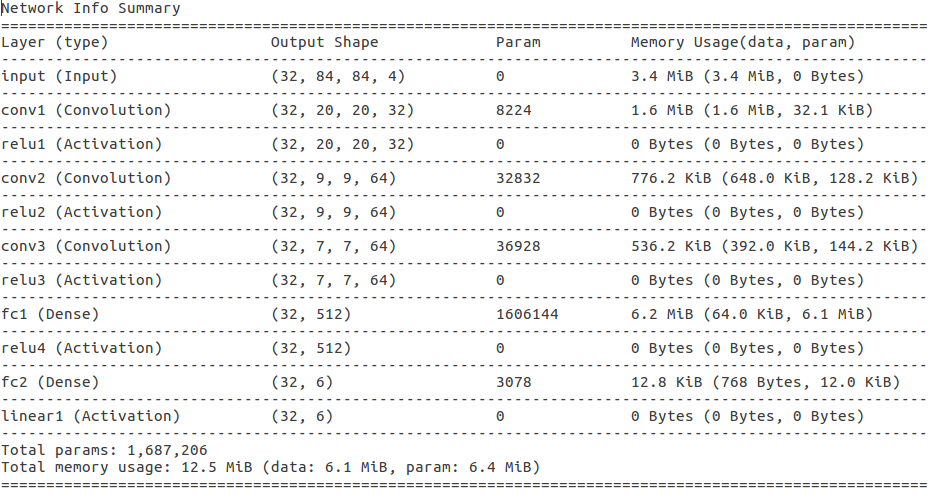
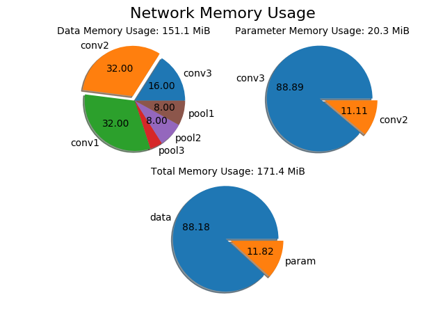

# CNN Memory Usage Monitor
A simple deep learning tool for monitoring data and parameter usage throughout CNN.

**Usage**:

*1. clone the github repository recursively including xinshuo_toolbox.*
~~~shell
git clone --recursive https://github.com/xinshuoweng/cnn_memory_usage_monitor
~~~

*2. install dependency for the toolbox.*
~~~shell
cd cnn_memory_usage_monitor
pip install requirements.txt
~~~

*3. define the network and print the memory info (one might want to look at example.py first for a quick and simple instruction).*
~~~shell
python example.py
~~~

**Example**:

